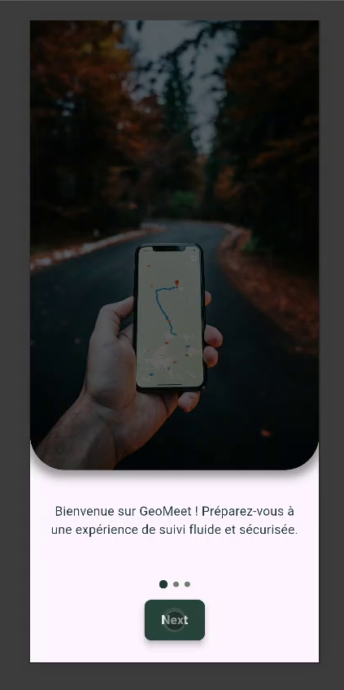
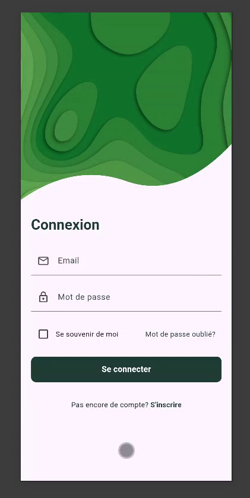
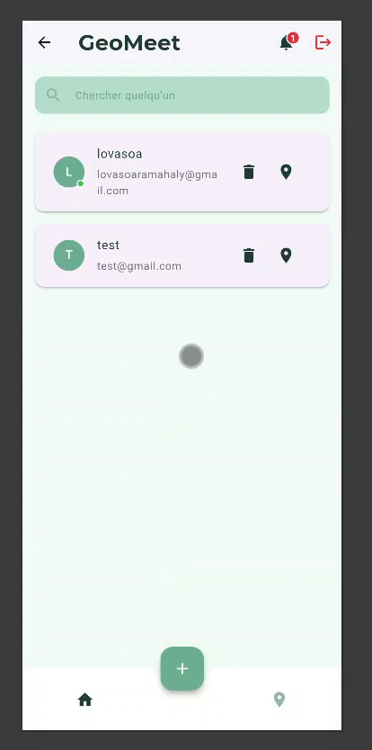
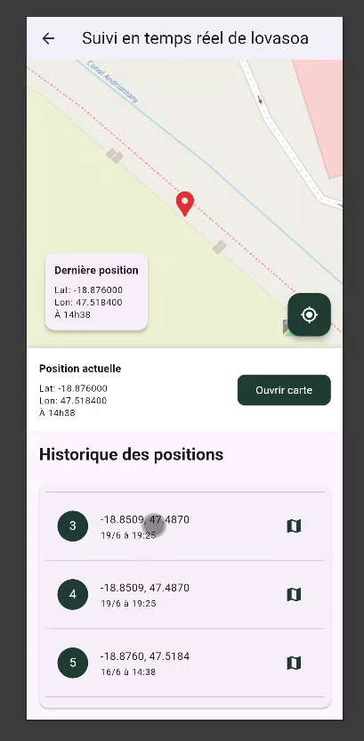

# 📱 GeoMeet
**GeoMeet** est une application mobile développée en **Flutter**, permettant à un utilisateur de suivre la position en temps réel d’un **téléphone secondaire** à l’aide d’un **téléphone principal**.  
Elle est conçue pour des usages comme le suivi parental, la localisation de ses propres appareils, ou des cas d’usage spécifiques (logistique, sécurité, etc.).

---

## Demonstration

### Splash


### Login


### Home


### Map


##  Fonctionnalités principales

- Suivi GPS en temps réel du téléphone secondaire
- Envoi périodique de la localisation via Internet (Firebase / HTTP)
- Authentification sécurisée (Firebase Auth ou autre)
- Affichage de la position sur Google Maps
- Mode "Utilisateur primaire" / "Utilisateur secondaire"
- Paramétrage de la fréquence de mise à jour

---

## Architecture du projet

Architecture recommandée : **MVVM** + **Provider** 
```
lib/
├── core/ # Constantes, utilitaires
├── data/ # Data sources (Firebase, REST)
├── domain/ # Entités et cas d'utilisation
├── presentation/ # UI, vues, widgets
├── app.dart # Configuration générale
└── main.dart # Point d’entrée
```


---

## Technologies utilisées

- **Flutter** (Frontend mobile)
- **Flutter Map** (affichage de la localisation)
- **Firebase** (Realtime Database ou Firestore + Auth + Cloud Messaging)
- **GeoLocator** (récupération GPS)
- **Provider** (gestion d’état)

---

##  Installation

1. Clone ce repo :
   ```bash
   git clone https://github.com/<ton-utilisateur>/phonetracking.git
   cd phonetracking

## Fonctionnalités principales

Authentification : Configuration automatique comme utilisateur primaire lors de la création d'un compte.
Localisation en temps réel via GPS.
Historique des déplacements.
Mode furtif pour le téléphone secondaire.
Gestion multi-profils (un utilisateur primaire pour plusieurs secondaires).


## Auteur

- Iharitiana RAMANANDRAIBE
- MISA TOKINIAINA
- YVES LOIC
- LOVASOA RM
- NALINA RAN
- NY ARO FENITRA
